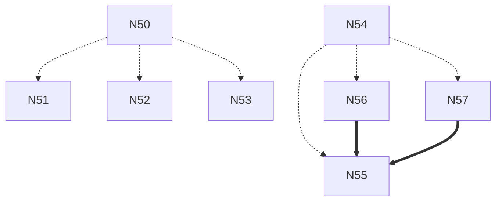
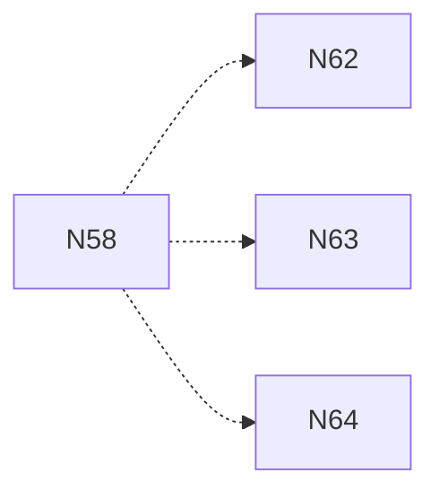
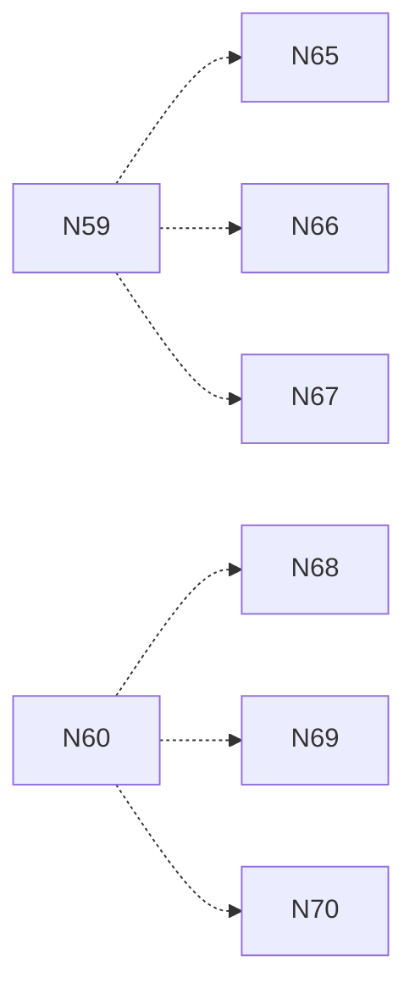
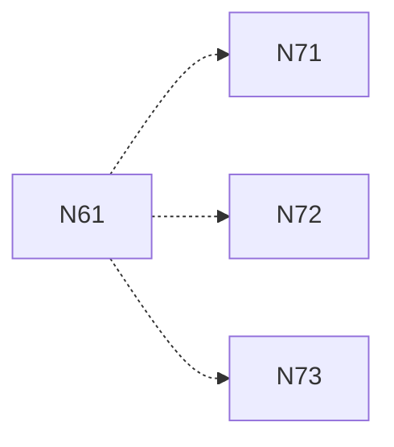

# Issues Overview

## Existing Issues

| issue title | issue id | roadmap area | roadmap milestone | priority | estimate | remarks | fate |
|---|---:|---|---|:---:|:---:|---|---|
| [M2] Minimal Linux CRT shim (_start) and freestanding CI job | 47 | Hardening and portability | M2 | P1 | 3 hrs |  | Keep |
| End-to-end tests | 39 | Backlog | M7 | P2 | 8 hrs |  | Split |
| Documentation and examples | 38 | Backlog | M7 | P3 | 5 hrs |  | Keep |
| BLAKE3 checksum option | 37 | Backlog | M7 | P3 | 3 hrs |  | Keep |
| Deep verify | 36 | Backlog | M7 | P2 | 8 hrs |  | Split |
| Query integration tests | 35 | Backlog | M6 | P2 | 5 hrs |  | Keep |
| CLI query commands | 34 | Backlog | M6 | P2 | 5 hrs |  | Keep |
| Query engine | 33 | Backlog | M6 | P1 | 13+ hours (split it up!) |  | Split |
| Cache writer | 32 | Backlog | M6 | P2 | 5 hrs |  | Keep |
| CRoaring integration | 31 | Backlog | M6 | P3 | 5 hrs |  | Keep |
| Indexer interface | 30 | Backlog | M6 | P2 | 5 hrs |  | Keep |
| Notes and tags integration tests | 29 | Backlog | M5 | P3 | 3 hrs |  | Keep |
| CLI enhancements | 28 | Backlog | M5 | P3 | 5 hrs |  | Keep |
| Tag association | 27 | Backlog | M5 | P3 | 3 hrs |  | Keep |
| Notes API | 26 | Backlog | M5 | P2 | 5 hrs |  | Keep |
| Threshold enforcement | 25 | Backlog | M4 | P2 | 5 hrs |  | Keep |
| Attestation support | 24 | Backlog | M4 | P2 | 5 hrs |  | Keep |
| Commit signature validation | 23 | Backlog | M4 | P2 | 5 hrs |  | Keep |
| Signature port | 22 | Backlog | M4 | P2 | 5 hrs |  | Keep |
| Trust document storage | 21 | Backlog | M4 | P2 | 5 hrs |  | Keep |
| Policy enforcement tests | 20 | Backlog | M3 | P2 | 3 hrs |  | Keep |
| Append enforcement | 19 | Backlog | M3 | P2 | 3 hrs |  | Keep |
| Author identity port | 18 | Backlog | M3 | P2 | 5 hrs |  | Keep |
| Policy parser | 17 | Backlog | M3 | P2 | 5 hrs |  | Keep |
| Policy document storage | 16 | Backlog | M3 | P2 | 5 hrs |  | Keep |
| Append/read integration tests | 15 | Backlog | M2 | P2 | 5 hrs |  | Keep |
| Read path | 14 | Backlog | M2 | P2 | 5 hrs |  | Keep |
| Append path | 13 | Backlog | M2 | P2 | 5 hrs |  | Keep |
| Ledger lifecycle | 12 | Backlog | M2 | P1 | 8 hrs |  | Keep |
| libgit2 adapter | 11 | Backlog | M2 | P1 | 8 hrs |  | Keep |
| Git repo port interface | 10 | Backlog | M2 | P1 | 5 hrs |  | Keep |
| Context lifecycle | 9 | Backlog | M1 | P1 | 5 hrs |  | Keep |
| Logger hooks | 8 | Backlog | M1 | P2 | 3 hrs |  | Keep |
| Allocator hooks | 7 | Backlog | M1 | P2 | 3 hrs |  | Keep |
| Error API | 6 | Backlog | M1 | P1 | 5 hrs |  | Keep |
| Coding standards | 5 | Backlog | M0 | P2 | 3 hrs |  | Keep |
| CI scaffolding | 4 | Backlog | M0 | P1 | 3 hrs |  | Keep |
| Dependency placeholders | 3 | Backlog | M0 | P3 | 1 hr |  | Keep |
| Dual build system bootstrap | 2 | Backlog | M0 | P2 | 3 hrs |  | Keep |
| Scaffold repo layout | 1 | Backlog | M0 | P2 | 3 hrs |  | Keep |

## M3

| Issue Title | Issue Id | Roadmap Area | Priority | Estimate | Remarks |
|---|---:|---|:---:|:---:|---|
| [M3] Public API v0.1 docs + visibility | 50 | Solidify core | P1 | 5 hrs | Parent feature; header export audit + docs artifact |
| [M3][API] Add Doxygen config + CMake target | 51 | Solidify core | P2 | 3 hrs | — |
| [M3][API] Annotate public headers with brief/group | 52 | Solidify core | P2 | 5 hrs | — |
| [M3][API] CI job: build + upload API docs artifact | 53 | Hardening and portability | P2 | 3 hrs | — |
| [M3] CLI scaffold + examples | 54 | Make it useful | P1 | 5 hrs | Parent feature; minimal CLI with examples |
| [M3][CLI] Subcommand framework + help | 55 | Make it useful | P1 | 5 hrs | — |
| [M3][CLI] Implement 'version' command | 56 | Make it useful | P2 | 3 hrs | — |
| [M3][CLI] Implement 'error-demo' command | 57 | Make it useful | P3 | 3 hrs | — |
| [M3] Windows DLL export audit + shared build CI | 58 | Hardening and portability | P1 | 5 hrs | Ensure exports, run tests on windows-latest |

## M4

| Issue Title | Issue Id | Roadmap Area | Priority | Estimate | Remarks |
|---|---:|---|:---:|:---:|---|
| [M4] Fuzzing harness for errors/version | 59 | Prove integrity | P2 | 5 hrs | libFuzzer targets for error JSON and snprintf |
| [M4] libgit2 adapter (read-only) skeleton | 60 | Solidify core | P1 | 8 hrs | Adapter interface + open/list objects |

## M5

| Issue Title | Issue Id | Roadmap Area | Priority | Estimate | Remarks |
|---|---:|---|:---:|:---:|---|
| [M5] Symbol-policy guard for archives (cross-platform) | 61 | Hardening and portability | P1 | 8 hrs | Deny/allow enforcement for lib archives on all OSes |

## M3

| Issue Title | Issue Id | Roadmap Area | Priority | Estimate | Remarks |
|---|---:|---|:---:|:---:|---|
| [M3][Win] Audit GITLEDGER_API exports for DLL | 62 | Hardening and portability | P1 | 3 hrs | Confirm only intended symbols exported |
| [M3][Win] Add MSVC shared build + test job | 63 | Hardening and portability | P1 | 5 hrs | Add Windows shared build to CI and run tests |
| [M3][Win] Fix printf/PRIuMAX and headers for MSVC | 64 | Hardening and portability | P2 | 3 hrs | Ensure MSVC-safe format macros and headers |

## M4

| Issue Title | Issue Id | Roadmap Area | Priority | Estimate | Remarks |
|---|---:|---|:---:|:---:|---|
| [M4][Fuzz] error_json fuzzer | 65 | Prove integrity | P2 | 3 hrs | libFuzzer target for error JSON |
| [M4][Fuzz] version_snprintf fuzzer | 66 | Prove integrity | P2 | 3 hrs | libFuzzer target for version snprintf |
| [M4][Fuzz] CI lane (10s per target) | 67 | Hardening and portability | P3 | 3 hrs | Optional short-budget fuzzing lane |
| [M4][git2] Define adapter interface header | 68 | Solidify core | P1 | 3 hrs | Introduce adapter abstraction and flag |
| [M4][git2] Implement open repository + fixtures | 69 | Solidify core | P1 | 5 hrs | Add open_repo() and seed tiny repo |
| [M4][git2] List commits (iterator) | 70 | Solidify core | P2 | 5 hrs | Iterator returns minimal commit rows |

## M5

| Issue Title | Issue Id | Roadmap Area | Priority | Estimate | Remarks |
|---|---:|---|:---:|:---:|---|
| [M5][sym] Linux archive policy (nm) | 71 | Hardening and portability | P1 | 5 hrs | Enforce allow/deny on .a via nm/objdump |
| [M5][sym] macOS archive policy (nm -U) | 72 | Hardening and portability | P1 | 5 hrs | Enforce allow/deny on .a via nm -U |
| [M5][sym] Windows archive policy (.lib) | 73 | Hardening and portability | P1 | 5 hrs | Enforce allow/deny on .lib via dumpbin/llvm-nm |

## Appendix A: Task Chains

Below are recommended parallel, MECE work streams derived from the DAG. Each chain lists tasks in order (top → bottom) and ends with a total estimate.

### CODENAME: GLASSFISH (API Docs + CLI)

| Issue Title | Issue Id | Roadmap Area | Priority | Estimate | Remarks |
|---|---:|---|:---:|:---:|---|
| [M3] Public API v0.1 docs + visibility | 50 | Solidify core | P1 | 5 hrs | Parent |
| [M3][API] Add Doxygen config + CMake target | 51 | Solidify core | P2 | 3 hrs |  |
| [M3][API] Annotate public headers with brief/group | 52 | Solidify core | P2 | 5 hrs |  |
| [M3][API] CI job: build + upload API docs artifact | 53 | Hardening and portability | P2 | 3 hrs |  |
| [M3] CLI scaffold + examples | 54 | Make it useful | P1 | 5 hrs | Parent |
| [M3][CLI] Subcommand framework + help | 55 | Make it useful | P1 | 5 hrs |  |
| [M3][CLI] Implement 'version' command | 56 | Make it useful | P2 | 3 hrs |  |
| [M3][CLI] Implement 'error-demo' command | 57 | Make it useful | P3 | 3 hrs |  |
| TOTAL |  |  |  | 32 hrs |  |

### CODENAME: GREENWAVE (Windows Shared + Exports)

| Issue Title | Issue Id | Roadmap Area | Priority | Estimate | Remarks |
|---|---:|---|:---:|:---:|---|
| [M3] Windows DLL export audit + shared build CI | 58 | Hardening and portability | P1 | 5 hrs | Parent |
| [M3][Win] Audit GITLEDGER_API exports for DLL | 62 | Hardening and portability | P1 | 3 hrs |  |
| [M3][Win] Add MSVC shared build + test job | 63 | Hardening and portability | P1 | 5 hrs |  |
| [M3][Win] Fix printf/PRIuMAX and headers for MSVC | 64 | Hardening and portability | P2 | 3 hrs |  |
| TOTAL |  |  |  | 16 hrs |  |

### CODENAME: TIDEPOOL (Fuzz + git2 Adapter)

| Issue Title | Issue Id | Roadmap Area | Priority | Estimate | Remarks |
|---|---:|---|:---:|:---:|---|
| [M4] Fuzzing harness for errors/version | 59 | Prove integrity | P2 | 5 hrs | Parent |
| [M4][Fuzz] error_json fuzzer | 65 | Prove integrity | P2 | 3 hrs |  |
| [M4][Fuzz] version_snprintf fuzzer | 66 | Prove integrity | P2 | 3 hrs |  |
| [M4][Fuzz] CI lane (10s per target) | 67 | Hardening and portability | P3 | 3 hrs |  |
| [M4] libgit2 adapter (read-only) skeleton | 60 | Solidify core | P1 | 8 hrs | Parent |
| [M4][git2] Define adapter interface header | 68 | Solidify core | P1 | 3 hrs |  |
| [M4][git2] Implement open repository + fixtures | 69 | Solidify core | P1 | 5 hrs |  |
| [M4][git2] List commits (iterator) | 70 | Solidify core | P2 | 5 hrs |  |
| TOTAL |  |  |  | 32 hrs |  |

### CODENAME: ANVIL (Archive Symbol Policy)

| Issue Title | Issue Id | Roadmap Area | Priority | Estimate | Remarks |
|---|---:|---|:---:|:---:|---|
| [M5] Symbol-policy guard for archives (cross-platform) | 61 | Hardening and portability | P1 | 8 hrs | Parent |
| [M5][sym] Linux archive policy (nm) | 71 | Hardening and portability | P1 | 5 hrs |  |
| [M5][sym] macOS archive policy (nm -U) | 72 | Hardening and portability | P1 | 5 hrs |  |
| [M5][sym] Windows archive policy (.lib) | 73 | Hardening and portability | P1 | 5 hrs |  |
| TOTAL |  |  |  | 23 hrs |  |

