# Roadmap Task DAG

This document shows the complete dependency graph for all tasks and organizes them into **execution waves** (antichains) representing work that can be done in parallel.

## Complete Task Dependency Graph

The full dependency graph with all 60 tasks and 80 dependency edges, grouped by execution phase:

```mermaid
%%{init: { 'theme': 'base', 'flowchart': { 'useMaxWidth': true, 'nodeSpacing': 50, 'rankSpacing': 60 } }}%%
flowchart TD
  %% Corrected DAG: 80 edges, 0 cycles, complete dependencies
  %% Generated by dependency analysis

  subgraph Phase1["Phase 1: Foundation (3w)"]
    N31["N31: CRoaring vendor"]
    N37["N37: BLAKE3 vendor"]
    N4["N4: CI scaffolding"]
    N47["N47: Minimal Linux CRT shim"]
    N51["N51: Doxygen config"]
    N6["N6: Error API"]
    N7["N7: Allocator hooks"]
    N8["N8: Logger hooks"]
    N9["N9: Context lifecycle"]
  end

  subgraph Phase2["Phase 2: Interfaces (2w)"]
    N10["N10: Git repo port interface"]
    N17["N17: Policy parser"]
    N18["N18: Author identity port"]
    N22["N22: Signature port"]
    N30["N30: Indexer interface"]
    N50["N50: Public API docs"]
    N52["N52: Annotate headers"]
    N53["N53: CI docs upload"]
    N58["N58: Windows DLL audit"]
    N59["N59: Fuzzing harness"]
    N61["N61: Symbol policy"]
    N62["N62: Audit exports"]
    N64["N64: MSVC printf fix"]
  end

  subgraph Phase3["Phase 3: Git Adapter (4w) ⚠️ CRITICAL"]
    N11["N11: libgit2 adapter"]
    N54["N54: CLI scaffold"]
    N55["N55: CLI framework"]
    N63["N63: MSVC build"]
    N65["N65: error_json fuzzer"]
    N66["N66: version fuzzer"]
    N68["N68: Adapter header"]
    N71["N71: Linux symbols"]
    N72["N72: macOS symbols"]
    N73["N73: Windows symbols"]
  end

  subgraph Phase4["Phase 4: Core Features (5w)"]
    N12["N12: Ledger lifecycle"]
    N16["N16: Policy document storage"]
    N21["N21: Trust storage"]
    N23["N23: Signature validation"]
    N56["N56: version command"]
    N57["N57: error-demo command"]
    N60["N60: Extended adapter"]
    N67["N67: Fuzzing CI"]
  end

  subgraph Phase5["Phase 5: Operations (4w)"]
    N13["N13: Append path"]
    N14["N14: Read path"]
    N24["N24: Attestation support"]
    N25["N25: Threshold enforcement"]
    N26["N26: Notes API"]
    N27["N27: Tag association"]
    N69["N69: Open repo fixtures"]
  end

  subgraph Phase6["Phase 6: Indexing (5w) ⚠️ COMPLEX"]
    N15["N15: Append/read integration tests"]
    N19["N19: Append enforcement"]
    N28["N28: CLI enhancements"]
    N29["N29: Notes/tags tests"]
    N32["N32: Cache writer"]
    N36["N36: Deep verify"]
    N70["N70: Commit iterator"]
  end

  subgraph Phase7["Phase 7: Query (3w)"]
    N20["N20: Policy enforcement tests"]
    N33["N33: Query engine"]
  end

  subgraph Phase8["Phase 8: Final Testing (2w)"]
    N34["N34: CLI query"]
    N35["N35: Query tests"]
    N39["N39: E2E tests"]
  end

  subgraph Phase9["Phase 9: Documentation (2w)"]
    N38["N38: Documentation"]
  end

  %% Dependencies (80 edges)
  N9 --> N10
  N10 --> N11
  N9 --> N12
  N11 --> N12
  N12 --> N13
  N12 --> N14
  N13 --> N15
  N14 --> N15
  N11 --> N16
  N9 --> N17
  N9 --> N18
  N13 --> N19
  N16 --> N19
  N17 --> N19
  N18 --> N19
  N19 --> N20
  N11 --> N21
  N9 --> N22
  N22 --> N23
  N11 --> N23
  N23 --> N24
  N21 --> N25
  N17 --> N25
  N16 --> N25
  N11 --> N26
  N12 --> N26
  N11 --> N27
  N12 --> N27
  N55 --> N28
  N26 --> N28
  N27 --> N28
  N26 --> N29
  N27 --> N29
  N9 --> N30
  N30 --> N32
  N31 --> N32
  N14 --> N32
  N32 --> N33
  N33 --> N34
  N55 --> N34
  N33 --> N35
  N14 --> N36
  N23 --> N36
  N25 --> N36
  N15 --> N38
  N20 --> N38
  N29 --> N38
  N35 --> N38
  N36 --> N39
  N33 --> N39
  N70 --> N39
  N9 --> N50
  N51 --> N52
  N51 --> N53
  N52 --> N53
  N9 --> N54
  N54 --> N55
  N55 --> N56
  N55 --> N57
  N9 --> N58
  N9 --> N59
  N11 --> N60
  N9 --> N61
  N9 --> N62
  N62 --> N63
  N9 --> N64
  N59 --> N65
  N59 --> N66
  N65 --> N67
  N66 --> N67
  N10 --> N68
  N60 --> N69
  N68 --> N69
  N69 --> N70
  N61 --> N71
  N61 --> N72
  N61 --> N73
  N6 --> N9
  N7 --> N9
  N8 --> N9

  %% Styling by phase
  style N4 fill:#e8f5e9
  style N6 fill:#e8f5e9
  style N7 fill:#e8f5e9
  style N8 fill:#e8f5e9
  style N9 fill:#e8f5e9
  style N47 fill:#e8f5e9
  style N51 fill:#e8f5e9
  style N31 fill:#e8f5e9
  style N37 fill:#e8f5e9
  style N10 fill:#e3f2fd
  style N17 fill:#e3f2fd
  style N18 fill:#e3f2fd
  style N50 fill:#e3f2fd
  style N52 fill:#e3f2fd
  style N53 fill:#e3f2fd
  style N58 fill:#e3f2fd
  style N62 fill:#e3f2fd
  style N64 fill:#e3f2fd
  style N22 fill:#e3f2fd
  style N59 fill:#e3f2fd
  style N61 fill:#e3f2fd
  style N30 fill:#e3f2fd
  style N11 fill:#fff3e0
  style N54 fill:#fff3e0
  style N55 fill:#fff3e0
  style N63 fill:#fff3e0
  style N65 fill:#fff3e0
  style N66 fill:#fff3e0
  style N68 fill:#fff3e0
  style N71 fill:#fff3e0
  style N72 fill:#fff3e0
  style N73 fill:#fff3e0
  style N12 fill:#f3e5f5
  style N16 fill:#f3e5f5
  style N56 fill:#f3e5f5
  style N57 fill:#f3e5f5
  style N21 fill:#f3e5f5
  style N23 fill:#f3e5f5
  style N67 fill:#f3e5f5
  style N60 fill:#f3e5f5
  style N13 fill:#fce4ec
  style N14 fill:#fce4ec
  style N24 fill:#fce4ec
  style N25 fill:#fce4ec
  style N69 fill:#fce4ec
  style N26 fill:#fce4ec
  style N27 fill:#fce4ec
  style N15 fill:#e0f2f1
  style N19 fill:#e0f2f1
  style N70 fill:#e0f2f1
  style N28 fill:#e0f2f1
  style N29 fill:#e0f2f1
  style N32 fill:#e0f2f1
  style N36 fill:#e0f2f1
  style N20 fill:#fff9c4
  style N33 fill:#fff9c4
  style N34 fill:#ffebee
  style N35 fill:#ffebee
  style N39 fill:#ffebee
  style N38 fill:#f5f5f5

  %% Critical path highlighting (red borders)
  style N6 stroke:#d32f2f,stroke-width:4px
  style N9 stroke:#d32f2f,stroke-width:4px
  style N10 stroke:#d32f2f,stroke-width:4px
  style N11 stroke:#d32f2f,stroke-width:4px
  style N12 stroke:#d32f2f,stroke-width:4px
  style N13 stroke:#d32f2f,stroke-width:4px
  style N19 stroke:#d32f2f,stroke-width:4px
  style N20 stroke:#d32f2f,stroke-width:4px
```

## Execution Wave Sequence

This diagram shows how the 9 execution waves flow sequentially:

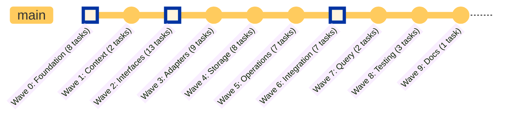

---

## Wave 0: Foundation — Truly Parallel (8 tasks)

These tasks have no dependencies on each other and can all be started immediately:

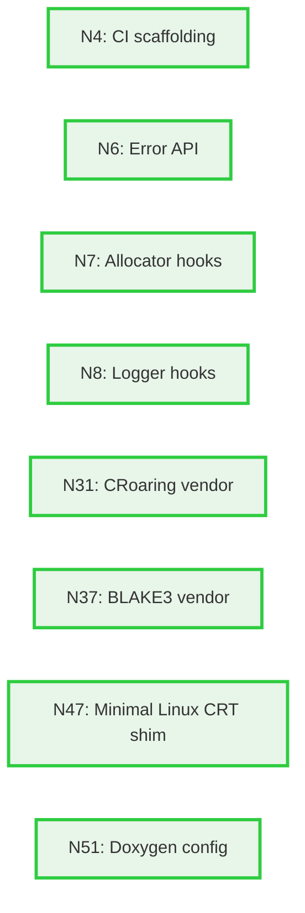

**Team allocation**: 3 FTE across 8 tasks

**Tasks**:
- N4: CI scaffolding (mostly complete)
- N6: Error API ⚠️ **CRITICAL PATH START**
- N7: Allocator hooks
- N8: Logger hooks
- N31: CRoaring integration
- N37: BLAKE3 checksum option
- N47: Minimal Linux CRT shim
- N51: Doxygen config + CMake target

---

## Wave 1: Context Lifecycle (2 tasks)

These tasks depend on Wave 0 foundation components:

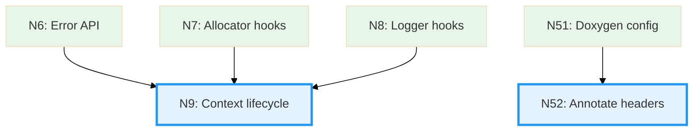

**Team allocation**: 2 FTE

**Tasks**:
- N9: Context lifecycle ⚠️ **CRITICAL PATH** (initialization, teardown, reference counting)
- N52: Annotate public headers with Doxygen comments

---

## Wave 2: Interfaces & Ports (13 tasks)

All interface definitions that depend on N9 context:

```mermaid
%%{init: { 'theme': 'base' }}%%
flowchart TD
  N9["N9: Context lifecycle"]
  N51["N51: Doxygen config"]
  N52["N52: Annotate headers"]

  N10["N10: Git repo port"]
  N17["N17: Policy parser"]
  N18["N18: Author identity port"]
  N22["N22: Signature port"]
  N30["N30: Indexer interface"]
  N50["N50: Public API docs"]
  N53["N53: CI docs upload"]
  N54["N54: CLI scaffold"]
  N58["N58: Windows DLL audit"]
  N59["N59: Fuzzing harness"]
  N61["N61: Symbol policy"]
  N62["N62: Audit exports"]
  N64["N64: MSVC printf fix"]

  N9 --> N10
  N9 --> N17
  N9 --> N18
  N9 --> N22
  N9 --> N30
  N9 --> N50
  N9 --> N54
  N9 --> N58
  N9 --> N59
  N9 --> N61
  N9 --> N62
  N9 --> N64
  N51 --> N53
  N52 --> N53

  style N10 fill:#e3f2fd,stroke:#2196f3,stroke-width:3px
  style N17 fill:#e3f2fd,stroke:#2196f3,stroke-width:3px
  style N18 fill:#e3f2fd,stroke:#2196f3,stroke-width:3px
  style N22 fill:#e3f2fd,stroke:#2196f3,stroke-width:3px
  style N30 fill:#e3f2fd,stroke:#2196f3,stroke-width:3px
  style N50 fill:#e3f2fd,stroke:#2196f3,stroke-width:3px
  style N53 fill:#e3f2fd,stroke:#2196f3,stroke-width:3px
  style N54 fill:#e3f2fd,stroke:#2196f3,stroke-width:3px
  style N58 fill:#e3f2fd,stroke:#2196f3,stroke-width:3px
  style N59 fill:#e3f2fd,stroke:#2196f3,stroke-width:3px
  style N61 fill:#e3f2fd,stroke:#2196f3,stroke-width:3px
  style N62 fill:#e3f2fd,stroke:#2196f3,stroke-width:3px
  style N64 fill:#e3f2fd,stroke:#2196f3,stroke-width:3px
```

**Team allocation**: 3.5 FTE for high parallelization

**Tasks**:
- N10: Git repo port interface ⚠️ **CRITICAL PATH**
- N17: Policy parser
- N18: Author identity port
- N22: Signature port
- N30: Indexer interface
- N50: Public API v0.1 docs + visibility
- N53: CI job for API docs artifact
- N54: CLI scaffold
- N58: Windows DLL export audit
- N59: Fuzzing harness
- N61: Symbol-policy guard
- N62: Audit GITLEDGER_API exports
- N64: Fix printf/PRIuMAX for MSVC

---

## Wave 3: Git Adapter & Extensions (9 tasks)

Implementation of adapters and platform-specific work:

```mermaid
%%{init: { 'theme': 'base' }}%%
flowchart TD
  N10["N10: Git repo port"]
  N54["N54: CLI scaffold"]
  N59["N59: Fuzzing harness"]
  N61["N61: Symbol policy"]
  N62["N62: Audit exports"]

  N11["N11: libgit2 adapter"]
  N55["N55: CLI framework"]
  N63["N63: MSVC build"]
  N65["N65: error_json fuzzer"]
  N66["N66: version fuzzer"]
  N68["N68: Adapter header"]
  N71["N71: Linux symbols"]
  N72["N72: macOS symbols"]
  N73["N73: Windows symbols"]

  N10 --> N11
  N10 --> N68
  N54 --> N55
  N59 --> N65
  N59 --> N66
  N61 --> N71
  N61 --> N72
  N61 --> N73
  N62 --> N63

  style N11 fill:#fff3e0,stroke:#ff9800,stroke-width:3px
  style N55 fill:#fff3e0,stroke:#ff9800,stroke-width:3px
  style N63 fill:#fff3e0,stroke:#ff9800,stroke-width:3px
  style N65 fill:#fff3e0,stroke:#ff9800,stroke-width:3px
  style N66 fill:#fff3e0,stroke:#ff9800,stroke-width:3px
  style N68 fill:#fff3e0,stroke:#ff9800,stroke-width:3px
  style N71 fill:#fff3e0,stroke:#ff9800,stroke-width:3px
  style N72 fill:#fff3e0,stroke:#ff9800,stroke-width:3px
  style N73 fill:#fff3e0,stroke:#ff9800,stroke-width:3px
```

**Team allocation**: 4 FTE — **CRITICAL BOTTLENECK**

**Tasks**:
- N11: libgit2 adapter ⚠️ **CRITICAL PATH** (3 weeks, highest complexity)
- N55: Subcommand framework + help
- N63: Add MSVC shared build + test job
- N65: error_json fuzzer
- N66: version_snprintf fuzzer
- N68: Define adapter interface header
- N71: Linux archive policy (nm)
- N72: macOS archive policy (nm -U)
- N73: Windows archive policy (.lib)

---

## Wave 4: Storage & Crypto (8 tasks)

Core ledger features and signature validation:

```mermaid
%%{init: { 'theme': 'base' }}%%
flowchart TD
  N9["N9: Context lifecycle"]
  N11["N11: libgit2 adapter"]
  N22["N22: Signature port"]
  N55["N55: CLI framework"]
  N65["N65: error_json fuzzer"]
  N66["N66: version fuzzer"]

  N12["N12: Ledger lifecycle"]
  N16["N16: Policy storage"]
  N21["N21: Trust storage"]
  N23["N23: Signature validation"]
  N56["N56: version command"]
  N57["N57: error-demo command"]
  N60["N60: Extended adapter"]
  N67["N67: Fuzzing CI"]

  N9 --> N12
  N11 --> N12
  N11 --> N16
  N11 --> N21
  N11 --> N23
  N22 --> N23
  N11 --> N60
  N55 --> N56
  N55 --> N57
  N65 --> N67
  N66 --> N67

  style N12 fill:#f3e5f5,stroke:#9c27b0,stroke-width:3px
  style N16 fill:#f3e5f5,stroke:#9c27b0,stroke-width:3px
  style N21 fill:#f3e5f5,stroke:#9c27b0,stroke-width:3px
  style N23 fill:#f3e5f5,stroke:#9c27b0,stroke-width:3px
  style N56 fill:#f3e5f5,stroke:#9c27b0,stroke-width:3px
  style N57 fill:#f3e5f5,stroke:#9c27b0,stroke-width:3px
  style N60 fill:#f3e5f5,stroke:#9c27b0,stroke-width:3px
  style N67 fill:#f3e5f5,stroke:#9c27b0,stroke-width:3px
```

**Team allocation**: 3 FTE (2 core, 1 security)

**Tasks**:
- N12: Ledger lifecycle ⚠️ **CRITICAL PATH** (open/close, create ledger refs)
- N16: Policy document storage
- N21: Trust document storage
- N23: Commit signature validation (complex crypto work)
- N56: Implement 'version' command
- N57: Implement 'error-demo' command
- N60: libgit2 adapter extended (read-only skeleton)
- N67: CI fuzzing lane (10s per target)

---

## Wave 5: Operations & Features (7 tasks)

User-facing append/read operations and metadata:

```mermaid
%%{init: { 'theme': 'base' }}%%
flowchart TD
  N11["N11: libgit2 adapter"]
  N12["N12: Ledger lifecycle"]
  N23["N23: Signature validation"]
  N60["N60: Extended adapter"]
  N68["N68: Adapter header"]

  N13["N13: Append path"]
  N14["N14: Read path"]
  N24["N24: Attestation"]
  N25["N25: Threshold enforcement"]
  N26["N26: Notes API"]
  N27["N27: Tag association"]
  N69["N69: Open repo fixtures"]

  N12 --> N13
  N12 --> N14
  N23 --> N24
  N21["N21: Trust storage"]
  N17["N17: Policy parser"]
  N16["N16: Policy storage"]
  N21 --> N25
  N17 --> N25
  N16 --> N25
  N11 --> N26
  N12 --> N26
  N11 --> N27
  N12 --> N27
  N60 --> N69
  N68 --> N69

  style N13 fill:#fce4ec,stroke:#e91e63,stroke-width:3px
  style N14 fill:#fce4ec,stroke:#e91e63,stroke-width:3px
  style N24 fill:#fce4ec,stroke:#e91e63,stroke-width:3px
  style N25 fill:#fce4ec,stroke:#e91e63,stroke-width:3px
  style N26 fill:#fce4ec,stroke:#e91e63,stroke-width:3px
  style N27 fill:#fce4ec,stroke:#e91e63,stroke-width:3px
  style N69 fill:#fce4ec,stroke:#e91e63,stroke-width:3px
```

**Team allocation**: 3 FTE

**Tasks**:
- N13: Append path ⚠️ **CRITICAL PATH** (optimistic locking, conflict detection)
- N14: Read path (entry retrieval, message decoding)
- N24: Attestation support (detached signatures)
- N25: Threshold enforcement (N-of-M signatures)
- N26: Notes API (attach artifacts)
- N27: Tag association (link tags to entries)
- N69: Implement open repository + fixtures

---

## Wave 6: Integration & Indexing (7 tasks)

Testing integration and performance-critical cache/query:

```mermaid
%%{init: { 'theme': 'base' }}%%
flowchart TD
  N13["N13: Append path"]
  N14["N14: Read path"]
  N16["N16: Policy storage"]
  N17["N17: Policy parser"]
  N18["N18: Author identity"]
  N23["N23: Signature validation"]
  N25["N25: Threshold enforcement"]
  N26["N26: Notes API"]
  N27["N27: Tag association"]
  N30["N30: Indexer interface"]
  N31["N31: CRoaring"]
  N55["N55: CLI framework"]
  N69["N69: Open repo fixtures"]

  N15["N15: Append/read tests"]
  N19["N19: Append enforcement"]
  N28["N28: CLI enhancements"]
  N29["N29: Notes/tags tests"]
  N32["N32: Cache writer"]
  N36["N36: Deep verify"]
  N70["N70: Commit iterator"]

  N13 --> N15
  N14 --> N15
  N13 --> N19
  N16 --> N19
  N17 --> N19
  N18 --> N19
  N55 --> N28
  N26 --> N28
  N27 --> N28
  N26 --> N29
  N27 --> N29
  N30 --> N32
  N31 --> N32
  N14 --> N32
  N14 --> N36
  N23 --> N36
  N25 --> N36
  N69 --> N70

  style N15 fill:#e0f2f1,stroke:#00897b,stroke-width:3px
  style N19 fill:#e0f2f1,stroke:#00897b,stroke-width:3px
  style N28 fill:#e0f2f1,stroke:#00897b,stroke-width:3px
  style N29 fill:#e0f2f1,stroke:#00897b,stroke-width:3px
  style N32 fill:#e0f2f1,stroke:#00897b,stroke-width:3px
  style N36 fill:#e0f2f1,stroke:#00897b,stroke-width:3px
  style N70 fill:#e0f2f1,stroke:#00897b,stroke-width:3px
```

**Team allocation**: 4 FTE — **HIGHEST COMPLEXITY**

**Tasks**:
- N15: Append/read integration tests
- N19: Append enforcement ⚠️ **CRITICAL PATH** (policy checks during append)
- N28: CLI enhancements (commands for notes/tags)
- N29: Notes and tags integration tests
- N32: Cache writer (complex: Roaring bitmap serialization)
- N36: Deep verify (full ledger integrity audit)
- N70: List commits (iterator)

---

## Wave 7: Query Engine (2 tasks)

Query functionality that depends on caching and enforcement:

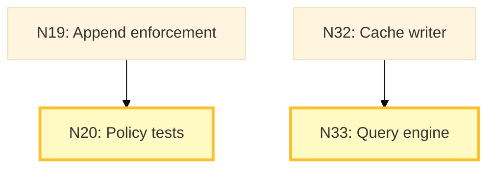

**Team allocation**: 2 FTE

**Tasks**:
- N20: Policy enforcement tests ⚠️ **CRITICAL PATH END**
- N33: Query engine (complex: Boolean term evaluation, bitmap operations)

---

## Wave 8: Final Testing & CLI (3 tasks)

User-facing query commands and end-to-end validation:

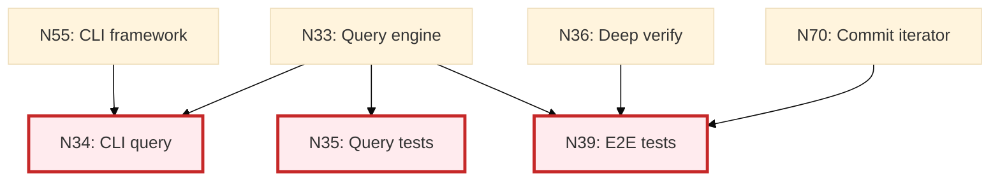

**Team allocation**: 2 FTE

**Tasks**:
- N34: CLI query commands
- N35: Query integration tests (Boolean query correctness)
- N39: End-to-end tests (full system validation)

---

## Wave 9: Documentation (1 task)

Final documentation after all features are complete:

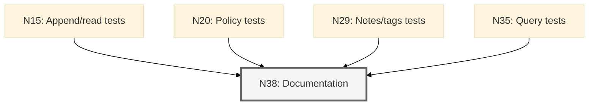

**Team allocation**: 1-2 FTE

**Tasks**:
- N38: Documentation and examples (sample encoders, server-side hook examples, tutorial)

---

## Critical Path Summary

The critical path (longest dependency chain) runs through these waves:

```
Wave 0: N6 (Error API)
  ↓
Wave 1: N9 (Context lifecycle)
  ↓
Wave 2: N10 (Git port interface)
  ↓
Wave 3: N11 (libgit2 adapter) ← **BIGGEST BOTTLENECK** (3 weeks)
  ↓
Wave 4: N12 (Ledger lifecycle)
  ↓
Wave 5: N13 (Append path)
  ↓
Wave 6: N19 (Append enforcement)
  ↓
Wave 7: N20 (Policy enforcement tests)
```

**Total critical path length**: ~16-18 weeks of serialized work

**Actual timeline with team**: 26 weeks (6.5 months) due to resource constraints and parallel streams

---

## Key Insights

1. **True parallelism**: Waves 0 and 2 have the most parallel work (8 and 13 tasks respectively)
2. **Bottlenecks**: Wave 3 (Git adapter) and Wave 6 (Cache writer) are the most complex
3. **Team sizing**: Peak staffing of 4 FTE in Waves 3 and 6
4. **Solo developer**: Would take ~72 person-weeks = 18 months
5. **Minimal MVP**: Waves 0-5 only (skip query/indexing) = 16 weeks for 1 developer

See `docs/PROJECT-PLAN.md` for detailed phase breakdowns, team composition, and risk mitigation strategies.
