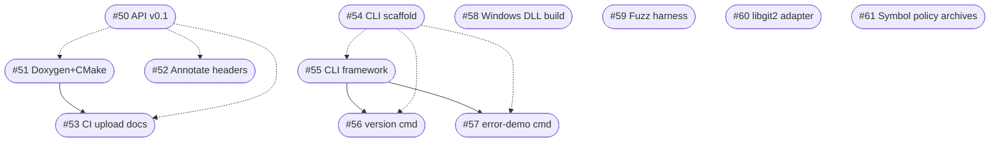

# Roadmap Task DAG

This diagram captures the dependency graph of the newly created roadmap issues.

Notes
- Solid arrows represent hard dependencies.
- Dashed arrows indicate grouping/soft tracking under a parent feature.
- Extend as more children are added under M4/M5.

