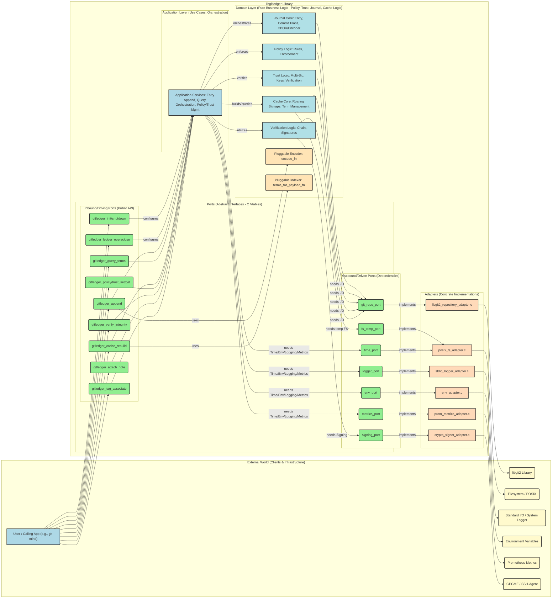
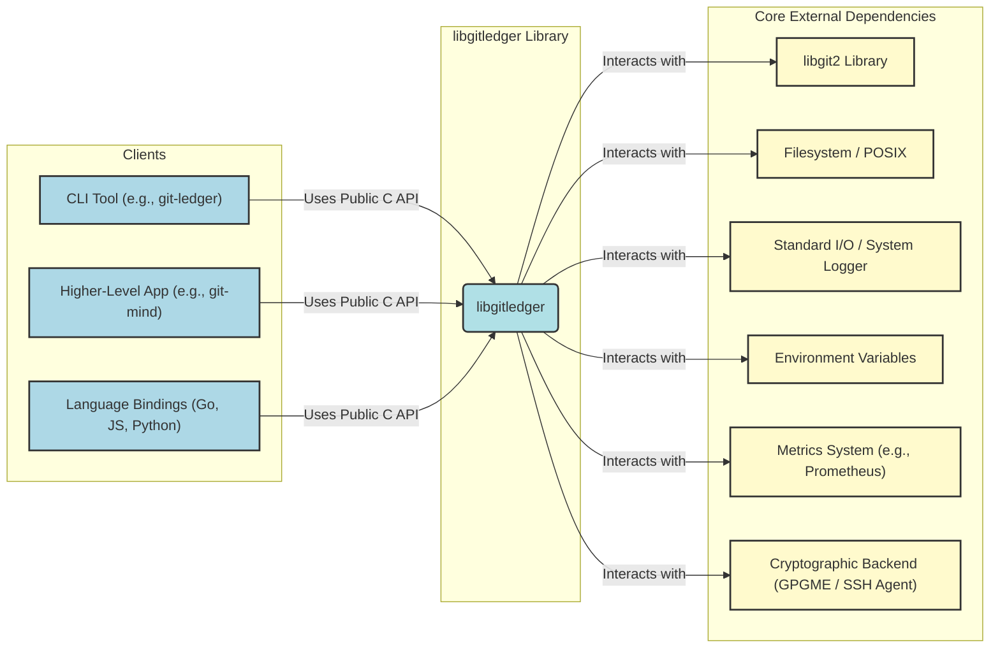
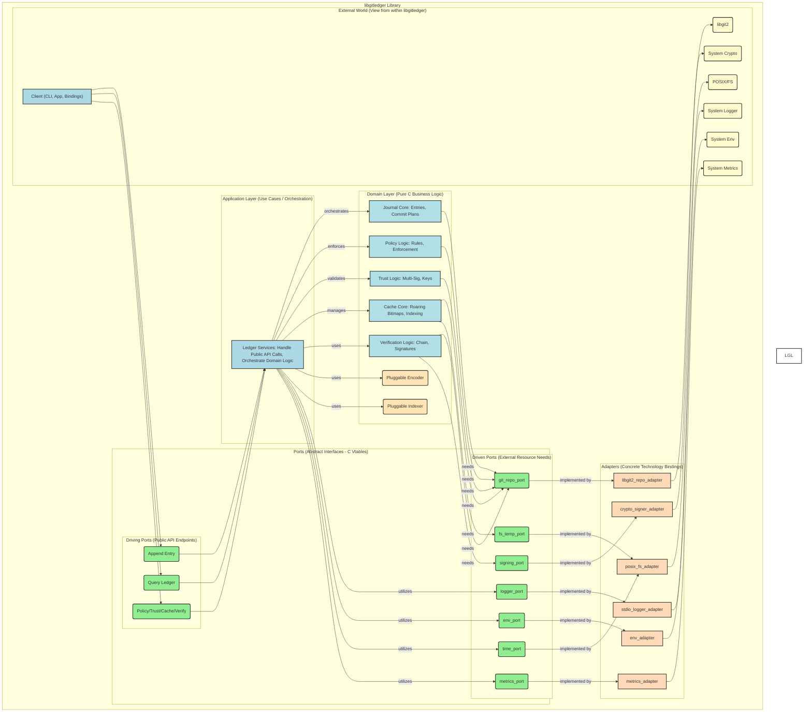
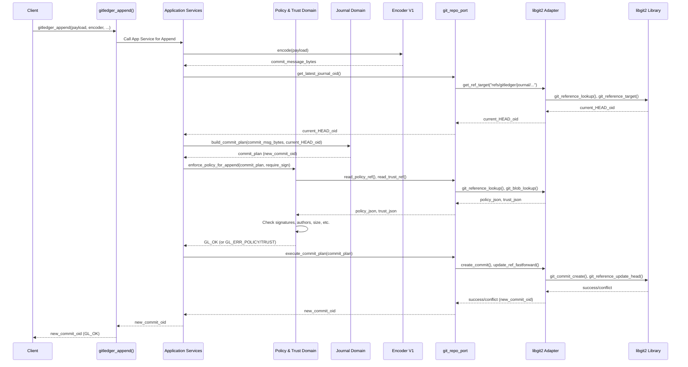

# `libgitledger`

> A *Git-Native* Ledger Library (C, `libgit2`): Spec + Project Plan with Step-By-Step Tasks & Tests

This is the unification of two proven systems: **Shiplog**’s field-tested deployment ledger and **git-mind**’s hexagonal, binary-safe engine, distilled into a reusable C library with a stable ABI and high-performance indexing. It uses Git itself as the database, leans on `libgit2`, and bakes in policy + trust. In short: batteries included, foot-guns removed.

---

## N. Document status

### Intended Audience

- Myself
- Reviewers
- Collaborators
- Future binding authors

### Decision log (short)

- **Git backend**: `libgit2` (not shelling out) — keeps things fast, safe, and embeddable.
- **Architecture**: strict Hexagonal (ports & adapters).
- **Governance**: Policy-as-Code + Multi-Signature Trust are first-class in the library (not app-specific).
- **Query performance**: Roaring bitmap cache, rebuildable.

These choices align with my previous work, the `git-mind`/`shiplog` lineage.

---

## I. Overview

`libgitledger` is a portable, embeddable C library for append-only ledgers inside a Git repository. Each ledger is a linear history of Git commits on dedicated refs; entries are optionally signed, policy-checked, and indexed for instant queries. It enables both human-readable (`shiplog` style) and binary-safe (`git-mind` style) payloads via a pluggable encoder. 

**Why this exists**: I’ve built the pattern twice already. `shiplog` (battle-tested CLI & policy/trust) and `git-mind` (rigorous hexagonal architecture + roaring bitmap cache). `libgitledger` fuses them into one stable core library with bindings for Go/JS/Python.

---

## II. Goals & Non-Goals

### Goals

- Git-native persistence (objects + refs are the DB).
- Append-only (fast-forward only), immutability by default.
- Library-first: stable C ABI, no global state; embeddable; safe for bindings.
- Pluggable encoder/indexer so shiplog and git-mind both fit naturally. 
- Policy as Code and Multi-Signature Trust (chain or attestation) built-in. 
- High-performance queries using roaring bitmap cache, fully rebuildable. 

### Non-Goals

- Not a full “ledger server”. No background daemons; it’s a library.
- Not a replacement for Git’s transport/auth or repo mgmt.
- No reliance on shelling out to `git(1)` in core; a separate optional adapter may be explored later for platforms where `libgit2` is unavailable.

---

## III. Core Principles

- **Git-Native**: object store + refs as the database; ref updates = writes.
- **Append-Only**: fast-forward updates; rejects history rewrites.
- **Hexagonal Architecture**: domain core is pure C; all I/O behind ports; libgit2 only in adapters. 
- **Pluggable Everything**: allocators, loggers, encoders, indexers. 
- **Secure & Auditable**: signing, policy enforcement, trust thresholds. 
- **Portable & Bindable**: stable ABI; minimal dependencies; deterministic behavior.

---

## IV. Reference Namespace & Data Model

**Ref map (per ledger `L`)**:

- **Journal (append-only commits)**: `refs/gitledger/journal/<L>`
- **Cache (roaring bitmaps)**: `refs/gitledger/cache/<L>`
- **Policy doc**: `refs/gitledger/policy/<L>`
- **Trust doc**: `refs/gitledger/trust/<L>`
- **Entry notes**: `refs/gitledger/notes/<L>`
- **Tag-entry associations (notes on tag objects)**: `refs/gitledger/tag_notes`

This structure blends `shiplog`’s policy/trust refs and `git-mind`’s journal/cache separation.

**Entry** = a Git commit on the ledger ref.

- Payload lives in the commit message (encoder-defined; can be human-readable with JSON trailers like `shiplog` or base64-CBOR like `git-mind`).
- **Notes**: arbitrary blobs (`stdout`/`stderr`, artifacts) via Git notes on the entry commit. (Shiplog’s `run` semantics made general.) 
- **Signatures**: commit signatures or detached attestations, enforced by policy/trust. 

---

## V. Architecture

### 5.1 Hexagonal (Ports & Adapters)









#### Domain Core

Pure C types & logic

- entries
- chain rules
- verification
- commit “plan” building

#### Ports (interfaces)

- `git_repo_port` (read/write objects/refs; notes; tags; signature extraction)
- `time_port`, `env_port`, `fs_temp_port`, `logger_port`, `metrics_port`, `signing_port` (optional)

#### Adapters

- `libgit2` adapter implements `git_repo_port`.
- `stdio` logger; `null` metrics; POSIX `temp-fs`, etc.

This mirrors `git-mind`’s pattern exactly, making unit tests trivial and adapters swappable. 

### 5.2 Memory & Logging

- **Pluggable allocator**: `gitledger_allocator_t` with user hooks; defaults to `malloc`/`free`.
- **Pluggable logger**: categories + levels, shipped stdio adapter.
- **Structured errors**: result + error types; error stacks. (Inspired by `gm_result_t`) 

---

## VI. Public C API (sketch)

**Header namespace**: `include/gitledger/…` with `gitledger.h` umbrella.

```c
#ifdef __cplusplus

extern "C" {

#endif

/* --- Opaque handles --- */

typedef struct gitledger_ctx gitledger_ctx_t;

typedef struct gitledger_ledger gitledger_ledger_t;

typedef struct gitledger_error gitledger_error_t;

typedef struct gitledger_iter gitledger_iter_t;

/* --- Basic types --- */

typedef enum {

GL_OK = 0, GL_ERR_IO, GL_ERR_GIT, GL_ERR_POLICY, GL_ERR_TRUST,

GL_ERR_NOT_FOUND, GL_ERR_CONFLICT, GL_ERR_INVALID, GL_ERR_NOSIG,

GL_ERR_UNSUPPORTED, GL_ERR_OOM, GL_ERR_INTERNAL

} gitledger_code_t;

typedef struct {

void *(*malloc_fn)(size_t);

void *(*realloc_fn)(void*, size_t);

void (*free_fn)(void*);

} gitledger_allocator_t;

typedef void (*gitledger_log_fn)(int level, const char *domain, const char *msg);

/* --- Encoders & Indexers --- */

typedef struct {

/* Input: user payload blob; Output: commit message bytes (NUL not required). */

int (*encode)(const void *payload, size_t payload_len,

char **out_msg, size_t *out_msg_len, gitledger_error_t **err);

} gitledger_encoder_v1_t;

typedef struct {

/* Output: array of "term" strings (e.g., "service:api", "status:ok"). */

int (*terms_for_payload)(const char *commit_msg, size_t msg_len,

char ***out_terms, size_t *out_term_count,

gitledger_error_t **err);

} gitledger_indexer_v1_t;

/* --- Init/Config --- */

int gitledger_init(gitledger_ctx_t **out, gitledger_error_t **err);

int gitledger_shutdown(gitledger_ctx_t *ctx);

int gitledger_set_allocator(gitledger_ctx_t *ctx, const gitledger_allocator_t *a);

int gitledger_set_logger(gitledger_ctx_t *ctx, gitledger_log_fn fn);

/* --- Ledger lifecycle --- */

int gitledger_ledger_open(gitledger_ctx_t *ctx, const char *repo_path,

const char *ledger_name, gitledger_ledger_t **out,

gitledger_error_t **err);

int gitledger_ledger_close(gitledger_ledger_t *L);

/* --- Append / Read --- */

int gitledger_append(gitledger_ledger_t *L,

const void *payload, size_t payload_len,

const gitledger_encoder_v1_t *enc,

int require_sign, /* policy default if -1 */

char /* oid[41] */ out_oid_hex[41],

gitledger_error_t **err);

int gitledger_get_latest_entry(gitledger_ledger_t *L,

char out_oid_hex[41], gitledger_error_t **err);

int gitledger_get_entry_message(gitledger_ledger_t *L, const char *oid_hex,

char **out_msg, size_t *out_len, gitledger_error_t **err);

/* --- Notes / Tags --- */

int gitledger_attach_note(gitledger_ledger_t *L, const char *oid_hex,

const void *note, size_t note_len,

gitledger_error_t **err);

int gitledger_tag_associate(gitledger_ledger_t *L, const char *tag_name,

const char *entry_oid_hex, gitledger_error_t **err);

/* --- Policy & Trust --- */

int gitledger_policy_get(gitledger_ledger_t *L, char **json, size_t *len, gitledger_error_t **err);

int gitledger_policy_set(gitledger_ledger_t *L, const char *json, size_t len, gitledger_error_t **err);

int gitledger_trust_get(gitledger_ledger_t *L, char **json, size_t *len, gitledger_error_t **err);

int gitledger_trust_set(gitledger_ledger_t *L, const char *json, size_t len, gitledger_error_t **err);

/* --- Cache & Query (roaring) --- */

int gitledger_cache_rebuild(gitledger_ledger_t *L, const gitledger_indexer_v1_t *indexer,

gitledger_error_t **err);

int gitledger_query_terms(gitledger_ledger_t *L, /* e.g., ["service:api","+author:j","-status:fail"] */

const char **terms, size_t nterms,

gitledger_iter_t **out_iter, gitledger_error_t **err);

int gitledger_iter_next(gitledger_iter_t *it, char out_oid_hex[41]);

int gitledger_iter_free(gitledger_iter_t *it);

/* --- Verify / Errors --- */

int gitledger_verify_ledger_integrity(gitledger_ledger_t *L, int deep, gitledger_error_t **err);

const char *gitledger_error_str(const gitledger_error_t *err);

void gitledger_error_free(gitledger_error_t *err);

#ifdef __cplusplus

}

#endif
```

**Notes:**

- Encoders return bytes; we do not force UTF-8. Git will store the bytes; use textual encodings (e.g., JSON + trailers; base64-CBOR) when needed. (Matches `shiplog`/`git-mind` styles.)
- Policy/Trust are JSON; the library enforces them during `append()` and on `verify_ledger_integrity()`. (Shiplog precedent.) 
- Tag association uses notes on tag objects under `refs/gitledger/tag_notes`. 

---

## VII. Policy & Trust (built-in)

### Policy as Code (per-ledger)

`policy.json` under `refs/gitledger/policy/<L>` with keys like:

- `require_signed: bool | "attestation" | "commit"`
- `allowed_authors: [emails]` (author allow-list)
- `allowed_encoders: [ids]` (optional)
- `max_entry_size_bytes`
- `push_protection: { server_enforced: bool }`

Enforced at append and verify time. Mirrors `shiplog`’s model, generalized for any ledger. 

### Multi-Signature Trust

`trust.json` under `refs/gitledger/trust/<L>` including:

- `maintainers: [{id, email, key_fingerprint}]`
- `threshold: N` (N-of-M approvals for trust changes)
- `signature_mode: "chain" | "attestation"`
- `allowed_signers: [...]`

Library verifies signatures of entries against current trust + policy; updates to `trust.json` themselves require quorum signatures. (Same governance pattern you already run.) 

### Signatures

- **Chain** = signed commit.
- **Attestation** = detached SSH/GPG signature note co-stored and linked.

Verification uses `libgit2` extraction + pluggable verification backend (GPGME/SSH sig adapter), defaulting to “present + fingerprint match” until crypto adapter is configured.

---

## VIII. Indexing & Querying

### Indexing

Indexer callback parses payload format and emits “terms” (`key:value`).

### Querying

Library builds roaring bitmaps: one bitmap per term; entry IDs are ordinal positions in the ledger chain.

Queries are boolean set ops over bitmaps (`AND`/`OR`/`NOT`). Cache is rebuildable from journal. This mirrors git-mind’s fast query path. 

Query API accepts a term array with leading operator shorthands (`+` for **MUST**, `-` for **MUST_NOT**). Result is an iterator of matching entry OIDs.

---

## IX. Concurrency, Atomicity, & Integrity

- **Append is optimistic**: we read `HEAD_oid`, create a commit object, then try to fast-forward `refs/gitledger/journal/<L>` from `HEAD_oid` → `new_oid`. If the ref moved, return `GL_ERR_CONFLICT` so the caller retries after reloading latest.
- **Integrity audit**: linear parent chain check, ref integrity, optional BLAKE3 checksums on ref tips. (You flagged this as “self-audit hooks.”) 

---

## X. Directory Layout (library repo)

```bash
libgitledger/
├─ include/gitledger/ # public headers
├─ core/domain/ # pure ledger logic
├─ core/ports/ # abstract ports (git, fs, logger, signer, etc.)
├─ core/adapters/libgit2/ # git adapter impl
├─ core/cache/ # roaring integration
├─ core/policy_trust/ # policy & trust logic
├─ adapters/ # logger/fs/env/signing adapters
├─ tests/ # unit + integration
└─ cli/ # 'git-ledger' demo tool
```

This is aligned to the hexagonal structure used in [git-mind](https://github.com/neuroglyph/git-mind).

---

## XI. Security Considerations

- No shell `exec` in core; signing/verification uses pluggable crypto adapters.
- Key material never stored by lib; only fingerprints/IDs in trust docs.
- Policy default-deny if document missing (configurable).
- Replay protection via append-only + trust verification; server-side hooks recommended (`pre-receive`) — pattern borrowed from `shiplog`. 

---

## XII. Bindings & ABI

- Stable C ABI (opaque handles; no inline structs in public headers).
- No global state; all config on a context or ledger handle.
- Bindings can map errors to idiomatic exceptions/results (Go, JS, Python).
- Threading: ledger handles are not thread-safe; concurrent reads via separate handles; concurrent appends require higher-level retry.

---

## XIII. Error API

Errors are represented by opaque `gitledger_error_t` structures. Creation helpers capture the source
location and attach optional causes, producing a causal chain that callers can walk with
`gitledger_error_walk` without recursion. Each error records:

- `domain` (`gitledger_domain_t`) and `code` (`gitledger_code_t`) — numerical values are frozen.
- `flags` (`GL_ERRFLAG_RETRYABLE`, `GL_ERRFLAG_PERMANENT`, `GL_ERRFLAG_AUTH`).
- A UTF-8 message allocated via the context allocator.
- Optional source file, line, function.
- Optional cause (retained, released via reference counting).

Creation entry points come in two layers:

- `gitledger_error_create_ctx_loc_v` / `_with_cause_ctx_loc_v` accept an explicit
  `gitledger_source_location_t` and a `va_list`; they never allocate internal temporaries and are
  safe for bindings that already captured formatting arguments.
- `GITLEDGER_ERROR_CREATE` / `GITLEDGER_ERROR_WITH_CAUSE` are inline helpers that forward to the
  above, automatically capturing `__FILE__`, `__LINE__`, and `__func__`, and they work even when no
  variadic arguments are supplied.

Default guidance per domain/code:

| Domain | Example Codes | Flags | Guidance |
|--------|----------------|-------|----------|
| `GL_DOMAIN_GIT` | `GL_CODE_NOT_FOUND`, `GL_CODE_CONFLICT` | none | Inspect code and decide retry. |
| `GL_DOMAIN_POLICY` | `GL_CODE_POLICY_VIOLATION` | `PERMANENT` | Do not retry automatically; surface policy result. |
| `GL_DOMAIN_TRUST` | `GL_CODE_TRUST_VIOLATION` | `PERMANENT`, `AUTH` | Require credential / trust escalation. |
| `GL_DOMAIN_IO` | `GL_CODE_IO_ERROR` | `RETRYABLE` | Retry with backoff. |

`gitledger_error_render_json` returns the exact byte count (including the terminating NUL) required
to encode the full causal chain as deterministic JSON. Rendering is iterative, capped by
`GITLEDGER_ERROR_MAX_DEPTH`, and emits `"truncated":true` when the chain exceeds that limit.
`gitledger_error_json` memoises the JSON in a context-owned scratch buffer so repeated logging does not
re-render; `gitledger_error_json_copy` duplicates it for callers that need the data to outlive the
context. Messages are treated the same way via `gitledger_error_message_copy`. Domain / code / flag
strings are available through `gitledger_domain_name`, `gitledger_code_name`, and
`gitledger_error_flags_format` for bindings that want symbolic names.

Errors are reference counted; contexts track all outstanding errors and free them during teardown.
`gitledger_error_release` descends iteratively (no recursion) so deeply nested causal stacks cannot
overflow a thread’s call stack. Callers can opt into shared ownership via `gitledger_error_retain`
when an error must outlive the originating context.

---

## XIV. Testing Strategy (global)

- Unit tests on domain (no Git), using fake ports (pure hexagonal advantage). 
- Adapter tests against `libgit2` with ephemeral repos.
- Integration tests covering policy/trust/signing, notes, tag association, cache rebuild + queries.
- Property tests (fuzz payloads, malformed policy/trust).
- CI in Docker matrix; protect the local repo (shiplog’s discipline carried over). 
